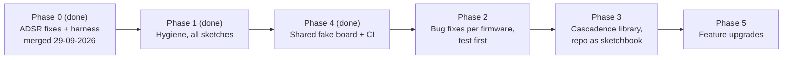

# Cascadence firmware upgrade plan

Date: 26-09-2026. Scope: the six sketches in `firmware/`, the board package in `software/CCTV`, and `firmware/README.MD`.

How the findings were obtained: a line-by-line review of every sketch, compiles of every sketch with the repo's own board package (flash and RAM figures below) and with avr-gcc warnings enabled, host-side runs of the ADSR, Euclidean and PolyCrossClock logic against a fake board, and the schematic in `hardware/`. Apart from the phase 0 hardware checks, whose status is recorded below, nothing in this document has been verified on the module yet; each phase ends with a hardware checklist.

## Executive summary

- Every firmware runs, none is clean. Four of six sketches have real bugs: ADSR (three, fixed, verified on the module and merged in [PR #2](https://github.com/FrankNFT-labs/cascadence/pull/2)), Euclidean (four), Turing Machine (three), PolyCrossClock (three). The Locking Sequencer has usability issues, the Template is fine but spreads the same boilerplate into every new firmware.
- The causes are structural, not individual mistakes: each sketch carries its own copy of the pin and DAC boilerplate, the DAC write is slow bit-banging, timing is blocking everywhere (`delay(40)` pulses, busy-waits on the clock input), and the board package compiles with all warnings off, so 18 warnings, including two "your init code never runs" bugs, were never seen.
- Recommended path: fix bugs per firmware behind host tests, then extract a shared `Cascadence` library with a fast DAC write and non-blocking helpers, make the repository an Arduino sketchbook with CI, and only then do feature work.
- Effort: about six focused working days in total, split into phases that each leave the repo in a releasable state. Main risks: timing changes alter how the envelopes and clocks feel, and the Turing quantizer needs a hardware measurement before it can be right.

## Verdicts

| Firmware | Verdict | Main reason |
|---|---|---|
| ADSR | Promising but flawed | Sound envelope core; port bugs fixed in PR #2; timing is tied to loop speed and the knob taper crowds the useful range into the top of the travel |
| Euclidean Sequencer | Promising but flawed | Pattern generator is correct for all 528 length/density pairs; the sequencing around it glitches every 32 clocks, never initialises the second channel, and fires B 40 ms after A |
| Turing Machine | Promising but flawed | Register logic matches the original; output wraps instead of clipping, and the quantizer constant is for a prototype with a different output range |
| PolyCrossClock | Promising but flawed | Good concept for the module; free-running divisions drift off the beat and the randomness knob wraps; phase 1 corrected its docs |
| Locking Sequencer | Strong, with rough edges | Simple and correct; pitch jitters from raw ADC reads, and the first clock plays step 2 |
| Template | Weak as a template | Compiles clean, but teaches the blocking pulse and copy-paste boilerplate; phase 1 removed its unusable `tinySPI` include |

## Inventory

Flash limit is 6012 bytes (8 KB minus the micronucleus bootloader), RAM is 512 bytes. Sizes are from the repo's board package; warnings are from avr-gcc 7.3 with `-Wall -Wextra`.

| Sketch | Last change | Lines | Flash | RAM | Warnings |
|---|---|---|---|---|---|
| ADSR | 30-09-2026 | 206 | 4114 (4366 before PR #2) | 72 (103) | 0 (before PR #2: 1, plus 2 that only clang reported) |
| Template | 30-09-2026 | 106 | 1026 | 18 | 0 |
| LockingSequencer | 30-09-2026 | 113 | 1336 | 34 | 2 (3 before phase 1) |
| euclideansequencer | 30-09-2026 | 273 | 4508 | 49 | 6 (7) |
| TuringMachine | 30-09-2026 | 147 | 2504 | 64 | 6 (7) |
| PolyCrossClock | 30-09-2026 | 159 | 3936 (4000 before phase 1) | 65 (73) | 0 |

## Hardware facts that shape the plan

Taken from `hardware/Cascadence-Schematic.pdf` and `software/CCTV/avr`.

- **MCU:** ATtiny84 at 8 MHz internal clock, no hardware multiplier, `double` is 4 bytes (same as `float`), `int` is 16 bits.
- **DAC:** MCP4812, which is 10-bit. Comments in the sketches say MCP4802 or MCP4822. The 12-bit frame the sketches send is right for the whole family; the DAC ignores the bottom two data bits.
- **DAC wiring rules out hardware SPI.** The DAC's data-in is on PA6, which is the USI's data-in pin, and chip select sits on PA5, the USI's data-out pin. The USI can only transmit on PA5, so `tinySPI` cannot drive this DAC. Five sketches included `tinySPI.h` without calling it, and the README said they rely on it; phase 1 removed both. Bit-banging is the only option, and direct port writes make it roughly ten times faster than `shiftOut`.
- **Clock/gate input:** an NPN inverter with the LED in its collector. PB2 reads LOW while the jack is high. Every sketch handles this correctly.
- **Toggle:** SPDT between +5 V and ground on PA7, so no pull-up is needed. HIGH means "A", "quantized" or "synced" in every sketch. The lever's left side reads HIGH, verified on the module on 29-09-2026.
- **Output stage:** TL072 non-inverting stage with two 10 k resistors, so gain 2 and roughly 8.2 V full scale from the DAC's 4.096 V. The product page says 0 to 10 V. Measure the real full scale before calibrating anything in volts; the Turing quantizer depends on it.

## Findings per firmware

Line numbers refer to the files as they were reviewed, and every link points at that version (commit b6390ae), because PR #2 and phase 1 have changed the files since.

### ADSR

Fixed in PR #2, merged on 29-09-2026, items 1 and 2 each with a host test that failed before the fix:

1. Pot scan slot 4 wrote past a 4-element stack array and past `lastanalogread`, where it overlapped the `millis()` counters ([ADSR.ino:177](https://github.com/FrankNFT-labs/cascadence/blob/b6390ae7c036aa3c369e67d43f6b8b86f140d007/firmware/ADSR/ADSR.ino#L177)).
2. Unsigned threshold compare wrapped for readings below 5, so a knob parked at zero was copied into the other envelope on every toggle flip ([ADSR.ino:189](https://github.com/FrankNFT-labs/cascadence/blob/b6390ae7c036aa3c369e67d43f6b8b86f140d007/firmware/ADSR/ADSR.ino#L189)).
3. Loop mode tested the `release_done` array itself, which is always true, and the upstream end-of-decay exit was missing, so enabling it hung the firmware ([ADSR.ino:114](https://github.com/FrankNFT-labs/cascadence/blob/b6390ae7c036aa3c369e67d43f6b8b86f140d007/firmware/ADSR/ADSR.ino#L114)). It was repaired first, then removed on 27-09-2026 together with `release_done`, because it had no panel control and the LFO use is out of scope. Flash went from 4366 to 4254 bytes.

Remaining, in priority order:

4. **Pots are not read while the gate is high.** The change detector runs outside the gate loop ([ADSR.ino:112](https://github.com/FrankNFT-labs/cascadence/blob/b6390ae7c036aa3c369e67d43f6b8b86f140d007/firmware/ADSR/ADSR.ino#L112)). With held notes, sustain and release changes only apply after the gate falls. Inherited from ADSRduino. Decision 27-09-2026: all four parameters stay live, as on an analog envelope. Reading the pots inside the gate loop is not enough on its own: the attack and decay constants are copied into `alpha` when a phase starts, and the sustain level into `drive` when decay starts. The fix must also update the phase in progress when its knob moves. The first-order filter turns each change into a glide, so no clicks.
5. **Envelope times depend on loop speed.** One envelope step per loop pass, and the pass is dominated by two bit-banged DAC writes plus an ADC read, roughly 0.6 to 1 ms (estimate, not measured). Any code added to the loop retunes every envelope. Fix direction: a fixed tick from `micros()` or a timer, one state-machine step per tick.
6. **Knob taper.** Over half the attack knob's travel gives a time constant under 10 passes; only the top 15 % gives more than 100. Full-clockwise release takes about 1.4 million passes to finish. Fix direction: exponential mapping from a chosen minimum to maximum time, computed only on knob change, which also lets `cos()` and `sqrt()` go.

   | Knob | Attack time constant (passes) | Release time constant (passes) |
   |---|---|---|
   | 0 % | 1.6 | 2 |
   | 50 % | 8.9 | 9 |
   | 90 % | 216 | 242 |
   | 100 % | 1999 | 199999 |

7. **No trigger mode.** The attack only advances while the gate is high, so a short trigger produces almost no envelope, although the README calls the input "trigger/gate".
8. **Loop mode: resolved by removal**, 27-09-2026. See item 3.
9. Hygiene: `setOutput` masks the high byte with 0xFF so a value of 4096 or more would flip control bits, the A and B code blocks are copy-pasted, and comments name the wrong DAC. PR #2 removed the dead `trigger` global and the unused variables, and phase 1 renamed the `MOSI` and `SCK` constants that clashed with ATTinyCore macros.

### Euclidean Sequencer

Fixed on branch `fix/euclidean` on 30-09-2026, each fix with a host test that failed before it: items 1 to 5, 7 and 8, and from item 6 the one-count-wide top values and the busy-wait. The dead band needed the knob scaling fixed first, so every knob value now gets an equal share of the travel. The `findlength` shift remains. The branch waits for the phase 2 hardware checklist while the module runs the ADSR.

1. **Neither channel is initialised at boot.** Lines 57 and 58 read `updatevalues[A];`, which references the function instead of calling it. avr-gcc says "statement is a reference, not call, to function". The channel the toggle does not select has length 0 until the toggle is flipped once, so its step computation divides by zero and its pattern is empty. Only the random inversion fires on that output, about 3 % of steps ([euclideansequencer.ino:57](https://github.com/FrankNFT-labs/cascadence/blob/b6390ae7c036aa3c369e67d43f6b8b86f140d007/firmware/euclideansequencer/euclideansequencer.ino#L57)).
2. **Patterns glitch every 32 clocks.** One shared step counter runs 0 to 31 and each channel takes `(step + offset) mod length` ([euclideansequencer.ino:70](https://github.com/FrankNFT-labs/cascadence/blob/b6390ae7c036aa3c369e67d43f6b8b86f140d007/firmware/euclideansequencer/euclideansequencer.ino#L70)). For any length that does not divide 32, the pattern restarts mid-cycle when the counter wraps. Fix direction: one step counter per channel, wrapped at that channel's length.
3. **Randomness at zero still inverts 1 step in 31.** `random(31) <= 0` is true whenever the draw is 0 ([euclideansequencer.ino:82](https://github.com/FrankNFT-labs/cascadence/blob/b6390ae7c036aa3c369e67d43f6b8b86f140d007/firmware/euclideansequencer/euclideansequencer.ino#L82)). The README promises no randomness at full counter-clockwise.
4. **B fires 40 ms after A.** Each pulse is a blocking 40 ms delay, and A is sent first ([euclideansequencer.ino:85](https://github.com/FrankNFT-labs/cascadence/blob/b6390ae7c036aa3c369e67d43f6b8b86f140d007/firmware/euclideansequencer/euclideansequencer.ino#L85)). When both channels hit on the same step, B is late by a 32nd note at 120 BPM, and two pulses block the loop for 80 ms, which caps the clock rate near 12 Hz.
5. **No hysteresis on the pots.** The pattern is recomputed on every pass from raw readings, so length and density flicker at bin edges, and the generator with its 128-byte stack array runs continuously for nothing.
6. Minor: `map()` gives its top value only at a reading of exactly 1023, so length 32 and full offset are one-count-wide bins; busy-wait on the clock input blocks pot reads while the clock is high; `findlength` shifts a 32-bit value by 32, which is undefined but harmless in practice. Phase 1 removed an unused variable.
7. **At offset 0 the rhythm starts on a rest.** The sketch plays the pattern from `euclid()`'s lowest bit, so three pulses over eight steps come out as `.x..x..x` instead of `x..x..x.`. It is still a Euclidean rhythm, rotated by one step, but most Euclidean sequencers put the first pulse on the downbeat. Found by the phase 4 tests. Decision 30-09-2026: fix it. Read from its highest bit, the pattern starts with a pulse for all 528 length/density pairs.
8. **Flipping the toggle overwrote the selected output.** The selected output followed all four knobs, so a flip copied their positions into it, and flipping back to A overwrote A with B's settings ([euclideansequencer.ino:105](https://github.com/FrankNFT-labs/cascadence/blob/b6390ae7c036aa3c369e67d43f6b8b86f140d007/firmware/euclideansequencer/euclideansequencer.ino#L105)). Found on 30-09-2026 while adding the dead band. Decision 30-09-2026: work as the ADSR does, where a flip changes nothing and a knob turned afterwards edits only its own setting of the selected output.

Good: `euclid()` returned the correct pulse count and length for every one of the 528 length/density pairs in a host sweep using AVR shift semantics. Keep it.

### Turing Machine

1. **Output wraps instead of clipping.** Scale (0 to 4095) plus shift (0 to 2047) can reach 6142 ([TuringMachine.ino:88](https://github.com/FrankNFT-labs/cascadence/blob/b6390ae7c036aa3c369e67d43f6b8b86f140d007/firmware/TuringMachine/TuringMachine.ino#L88)). `setOutput` drops bit 12, so 6142 lands on the DAC as 2046: with scale and offset both high, the pitch jumps down instead of pinning at the top. Fix direction: clamp to 4095.
2. **Quantizer constant is for the prototype.** 83 counts per semitone assumes 4.096 V full scale; the comment on line 39 says so. The shipped output stage doubles that, which makes the step about 41.7 counts, so the quantizer snaps to whole tones. Fix direction: measure volts per count on a real unit, set the constant from that, and consider a stored calibration value.
3. **CV lands 40 ms late whenever a pulse fires.** The blocking pulse on B runs before the CV write to A ([TuringMachine.ino:102](https://github.com/FrankNFT-labs/cascadence/blob/b6390ae7c036aa3c369e67d43f6b8b86f140d007/firmware/TuringMachine/TuringMachine.ino#L102)). Steps with a pulse and steps without get different CV timing. Fix direction: write the CV first, make the pulse non-blocking.
4. Same no-op init as the Euclidean sketch (lines 63 and 64). Harmless here because `loop()` reads the pots every pass, except when the clock is already low at power-up, which processes one step with length 0 and divides by zero inside `map()`.
5. `random()` is never seeded, so the register plays the same sequence after every power-up. Seed from a floating ADC channel or a counter in EEPROM.
6. Minor: busy-wait on the clock; `map()` top bin one count wide. Phase 1 removed the unused variables.

Not a bug: `seq_randomness` is a `char` holding -10 to 100. avr-gcc's `char` is signed, so full counter-clockwise inverts every step and full clockwise locks the loop, as documented.

### Locking Sequencer

1. **Pitch jitters.** Pots are read raw on every pass and one ADC count is one DAC step on the 10-bit DAC, about 8 mV or roughly 10 cents at 1 V per octave ([LockingSequencer.ino:76](https://github.com/FrankNFT-labs/cascadence/blob/b6390ae7c036aa3c369e67d43f6b8b86f140d007/firmware/LockingSequencer/LockingSequencer.ino#L76)). Fix direction: the same dead-band change detection the ADSR uses.
2. **The first clock plays step 2.** `step` is incremented before the first output ([LockingSequencer.ino:63](https://github.com/FrankNFT-labs/cascadence/blob/b6390ae7c036aa3c369e67d43f6b8b86f140d007/firmware/LockingSequencer/LockingSequencer.ino#L63)).
3. `currentoutput` is read before it is written, which the compiler flags. Harmless, but initialise it.
4. Feature gap: no quantizer, while the Turing Machine has one. A shared quantizer helper serves both.

### PolyCrossClock

Found with a host simulation of the sketch against a faked clock, at 120 BPM with four divisions.

1. **Free-running divisions drift off the beat.** Ticks are rescheduled from the time the loop noticed them, not from when they were due ([PolyCrossClock.ino:98](https://github.com/FrankNFT-labs/cascadence/blob/b6390ae7c036aa3c369e67d43f6b8b86f140d007/firmware/PolyCrossClock/PolyCrossClock.ino#L98)). Loop latency accumulates and output B collects it once per division. Scheduling from the due time gave zero lag over 600 beats in the same simulation. A clock patched into the input hides this, because every pulse resets both outputs.

   | Assumed time per loop pass | Lag after 30 beats | Lag after 120 beats |
   |---|---|---|
   | 0.4 to 0.6 ms | 23 ms | 92 ms |
   | 0.8 to 1.2 ms | 51 ms | 192 ms |

2. **Randomness knob wraps.** The reading goes into an 8-bit variable ([PolyCrossClock.ino:62](https://github.com/FrankNFT-labs/cascadence/blob/b6390ae7c036aa3c369e67d43f6b8b86f140d007/firmware/PolyCrossClock/PolyCrossClock.ino#L62)), so the knob sweeps from no drops to a quarter of pulses dropped four times over its travel.
3. **One stretched pulse every 71.6 minutes.** `now >= next` comparisons break when `micros()` rolls over; the simulation showed a 163 ms pulse instead of 40 ms. Fix direction: compare `(long)(now - next) >= 0`.
4. **Input sync is level-triggered.** While the input is low, both outputs are retriggered every pass, so they stay high for the input pulse length plus 40 ms, and the tempo restarts from the end of the input pulse ([PolyCrossClock.ino:87](https://github.com/FrankNFT-labs/cascadence/blob/b6390ae7c036aa3c369e67d43f6b8b86f140d007/firmware/PolyCrossClock/PolyCrossClock.ino#L87)). Fix direction: edge detection.
5. **Docs are wrong.** The header says tempo 30 to 120 BPM, the knob spans 30 to 600. The README says the clock input is unused; it resets both outputs. The README's cross and randomness texts are copied from the Euclidean entry. Phase 1 corrected the header and the README entry.
6. Minor, all fixed in phase 1: `tinySPI` include; `previousValues` is written and never read; one `setOutput(0, ...)` where the others say `A`.

### Template

Compiles clean. Problems are in what it teaches: the `tinySPI` include that cannot work on this board, a blocking 40 ms `SendPulse`, an extra brace pair inside `loop()`, and a comment that says the shutdown flag disables chip select. Phase 1 removed the include, the extra braces and the wrong comment. After phase 3 it should become the smallest possible consumer of the shared library.

## Cross-cutting findings

- **Six copies of the same boilerplate.** Pin constants, DAC constants and `setOutput` are pasted into every sketch. A fix in one never reaches the others.
- **The board package hides every warning.** `platform.txt` compiles with `-w` ([platform.txt:7](https://github.com/FrankNFT-labs/cascadence/blob/b6390ae7c036aa3c369e67d43f6b8b86f140d007/software/CCTV/avr/platform.txt#L7) and [line 12](https://github.com/FrankNFT-labs/cascadence/blob/b6390ae7c036aa3c369e67d43f6b8b86f140d007/software/CCTV/avr/platform.txt#L12)). With `-Wall -Wextra` the sketches produce 18 warnings, two of which are the no-op init bugs above. After phase 1, 14 remain: 12 from those two bugs and 2 from the Locking Sequencer's uninitialised `currentoutput`.
- **`MOSI` and `SCK` as constant names** break the build on ATTinyCore, which defines them as macros. Only the repo's own package accepted the sketches as written, until phase 1 renamed the constants to `DAC_MOSI` and `DAC_SCK`.
- **`setOutput` never clamps or masks.** Any value of 4096 or more corrupts the DAC control bits. Only the Turing Machine reaches that today, but a shared write should refuse it.
- **Blocking timing everywhere.** `delay(40)` pulses and `while (clock low)` loops in four sketches. Every timing complaint above traces back to this.
- **No tests, no CI.** Phase 4 added host tests for every sketch in `firmware/test/`, and a CI workflow that builds and tests every pull request.
- **Licensing is unverified.** The ADSR is based on m0xpd's ADSRduino and the Euclidean generator on Tom Whitwell's code. The repository has no LICENSE file. Check both upstream licences before publishing derived work.

## Architecture decisions

### ADR-1: One shared `Cascadence` library, repository as sketchbook

- **Context.** Six sketches duplicate the board layer, and a new firmware starts by copying the Template. Arduino sketches cannot include a sibling folder, but a sketchbook picks up `libraries/` and `hardware/` automatically.
- **Decision.** Create `firmware/libraries/Cascadence/` with a header-only board layer: pin names, `dacWrite(channel, value)`, `readPot(n)` with dead-band change detection, `clockEdge()`, `Pulse` timers and a `Quantizer`. Move the board package to `firmware/hardware/CCTV/`. Document "set your sketchbook to the repo's `firmware` folder"; `arduino-cli` gets the same through `ARDUINO_DIRECTORIES_USER`.
- **Consequences.** Each sketch shrinks to its own logic and gets fixes for free. Users must change one IDE setting instead of copying a folder. The old `software/CCTV` path stays as a symlink or a README pointer for one release.

### ADR-2: Direct port writes for the DAC, drop `tinySPI`

- **Context.** Hardware SPI cannot reach the DAC on this board (see hardware facts). `shiftOut` costs three slow pin writes per bit, roughly 50 per DAC write, and dominates every loop.
- **Decision.** `dacWrite` toggles PA4, PA5 and PA6 through `PORTA` directly, clamps the value to 4095, and keeps the MCP48x2 frame layout. Remove every `tinySPI.h` include and the README claim; phase 1 did.
- **Consequences.** DAC writes drop from an estimated 250 to 350 µs to under 30 µs, which makes phase 3 timing work possible. The bit order and timing must be checked once on a scope. Sketches no longer need an external library to build.

### ADR-3: Non-blocking timing model

- **Context.** Blocking pulses and busy-waits cause the late-B pulse, the late CV, the unread pots during gates, and the loop-speed-dependent envelopes.
- **Decision.** Every sketch becomes a loop of `read inputs, advance state, write outputs` with no waits. Pulses are timers polled each pass. Clock input is edge-detected. Anything periodic (envelope steps, clock ticks) is scheduled from due times using wrap-safe `micros()` arithmetic.
- **Consequences.** Timing becomes independent of what else the loop does. Envelope and clock behaviour will change slightly and must be re-listened to; time constants in the ADSR must be re-derived for the tick rate.

### ADR-4: Host-side tests and CI

- **Context.** Every finding above was found or confirmed by compiling the sketch as plain C++ against a fake board. Nothing runs automatically.
- **Decision.** Generalise the ADSR harness into `firmware/test/` with one fake board (pots, toggle, inverted clock input, DAC recorder) shared by all sketches. Add a GitHub Actions workflow that compiles every sketch with the repo board package, fails when a sketch exceeds 6012 bytes, and runs the host tests with UndefinedBehaviorSanitizer.
- **Consequences.** Regressions in logic are caught without hardware. Hardware still has to verify timing and voltages; the checklists below stay.
- **Update 30-09-2026.** Done in phase 4. The tests compile with GCC rather than the system compiler, because clang rejects code that avr-gcc only warns about. GCC on macOS has no UBSan runtime, so there the sanitizer runs in trap mode; CI on Linux runs it in full.

### ADR-5: Board package with warnings on

- **Context.** `-w` hid the two no-op init bugs for six years.
- **Decision.** Replace `-w` with `-Wall -Wextra` in `platform.txt`, add `-flto` (saves about ten per cent of flash on the ADSR build), keep the 6012-byte limit.
- **Consequences.** Users see warnings in the IDE; existing sketches must be warning-free first. Update 30-09-2026: the last 14 warnings come from bugs that need a failing test before the fix, so the switch moves to the end of phase 2. `-flto` changes the generated code and with it the ADSR's loop speed, which sets its envelope times, so it waits for phase 5's fixed tick or ships earlier with a listening check.

## Phases



Each phase is one or more branches named `fix/...`, `feat/...` or `docs/...`, one concern per commit, bug fixes never mixed with refactors.

### Phase 0: ADSR fixes (done, verified on hardware)

Merged into master through PR #2 on 29-09-2026: host test harness, the scan and threshold fixes, and the loop-mode removal.

Status 29-09-2026: flashed onto the module with a USBasp (see `AGENTS.md`), and all four checks below passed before the merge.

Hardware checklist before merging:

- [x] Flip the toggle left, turn the sustain knob well away from its current position and hold a gate: only output A (bottom left) should settle at the new level. If B does instead, left and right are swapped in the ADSR README and in `AGENTS.md`.
- [x] Park the sustain knob fully counter-clockwise on A, flip the toggle to B, confirm B's sustain does not change.
- [x] Hold a long gate, confirm attack, decay and sustain on both outputs; release, confirm both fall to zero.
- [x] Leave the module running for 10 minutes with a sequencer clock, confirm no stuck output.

### Phase 1: Hygiene across all sketches (done)

Done on branch `fix/phase-1-hygiene` on 30-09-2026, one concern per commit:

- Removed the unused `tinySPI.h` include from five sketches, and the README claim.
- Renamed `MOSI` and `SCK` to `DAC_MOSI` and `DAC_SCK`, so ATTinyCore builds the sketches as they are.
- Removed unused variables, including PolyCrossClock's never-read `previousValues` copy.
- Fixed the Template's stray braces and shutdown comment, and wrote PolyCrossClock's one `setOutput(0, ...)` as `A`.
- Corrected the PolyCrossClock header and README entry.
- Added a `.gitignore` for macOS `.DS_Store` files.

Every sketch builds to byte-identical firmware before and after, except PolyCrossClock, which lost 64 bytes of flash and 8 of RAM; a symbol comparison shows that only `updatevalues()` shrank. No hardware check was needed. Warnings under `-Wall -Wextra` went from 17 to 14.

Moved out on 30-09-2026, because each changes behaviour or timing, and a behaviour fix needs a failing test first while only the ADSR has a harness:

- The `updatevalues[A];` no-op init fix, to phase 2 (Euclidean and Turing Machine).
- The clamp in `setOutput`, to phase 2 for the Turing Machine, the only sketch that goes past 4095; phase 3's shared `dacWrite` clamps for every sketch.
- `-Wall -Wextra` in `platform.txt`, to the end of phase 2, when the last warnings are gone.
- `-flto`, to after phase 5's fixed-tick ADSR, or earlier with a listening check (ADR-5).

### Phase 2: Bug fixes per firmware, test first

Each firmware on its own `fix/` branch, each fix preceded by a failing host test, so this phase starts after phase 4's shared fake board. Risk low, all changes are local.

| Firmware | Fixes | Effort |
|---|---|---|
| Euclidean | Per-channel step counters; randomness 0 means none; init both channels; simultaneous non-blocking A and B pulses; pot dead band, with equal knob steps so the dead band cannot hide the top value; first pulse on the downbeat | 4 h |
| Turing Machine | Clamp output; init both channels; CV before pulse, non-blocking pulse; seed `random()`; semitone constant from a measured full scale | 3 h plus one hardware measurement |
| PolyCrossClock | Due-time scheduling; wrap-safe comparisons; full randomness range; edge-triggered sync | 3 h |
| Locking Sequencer | Pot dead band; start on step 1; initialise `currentoutput` | 1.5 h |

The phase 4 tests worked around two Euclidean bugs: they flipped the toggle once before the first clock, and drew no zeros from `random()`. Branch `fix/euclidean` fixes both bugs and drops the workarounds.

Order, decided 30-09-2026: the Euclidean and the Turing Machine first, because they are in use next to the ADSR, then PolyCrossClock and the Locking Sequencer. The ADSR has no phase 2 work: phase 0 fixed its bugs, and what remains of it is phase 5 feature work. Each firmware gets its own branch and draft PR. The module runs the ADSR in the meantime, so a branch waits for its hardware checklist until the module is free, and several can be open at once. A branch touches only its own sketch, its own test file and its own entries in the docs, so the branches merge in any order; the shared tables and the executive summary are updated on master after each merge.

Gate: after the last fix, switch `platform.txt` from `-w` to `-Wall -Wextra` (ADR-5); every sketch must then compile with zero warnings.

Hardware checklist: Euclidean length 5, density 2, run 64 clocks, confirm no restart at clock 32, both outputs fire together, and each cycle starts on a pulse. Turing scale and offset both full, confirm the CV pins at the top instead of dropping. PolyCrossClock free-running for 5 minutes with the toggle on quantized, confirm B stays on the beat.

### Phase 3: Cascadence library and sketchbook layout (ADR-1, ADR-2, ADR-3)

Effort 1 to 1.5 days. Risk medium: behaviour of every sketch must be re-verified on hardware, and the DAC bit-banging must be checked on a scope once.

- Write `firmware/libraries/Cascadence/Cascadence.h` with the API from ADR-1, `dacWrite` per ADR-2, `Pulse`, `clockEdge`, `readPot`, `Quantizer`.
- Move the board package to `firmware/hardware/CCTV/`, update `software/README.md`.
- Migrate the Template first, then one sketch per branch: Locking Sequencer, Turing Machine, Euclidean, PolyCrossClock, ADSR.
- Gate: host tests from phase 2 still pass unchanged against each migrated sketch, flash sizes go down, CI green.

### Phase 4: Shared fake board and CI (ADR-4, done)

Done on branch `feat/phase-4-shared-test-board` on 30-09-2026, so every phase 2 fix can start with a failing host test:

- `firmware/test/` holds one fake board, a test runner, and a Makefile that builds one test binary per sketch. The 12 ADSR tests moved over unchanged, and three reintroduced ADSR bugs fail the same tests on the old and the new harness.
- Every other sketch has a test file, 30 tests in all. They describe what works today, and one mutant per sketch fails the test aimed at it.
- The tests compile with GCC, because clang rejects code that avr-gcc only warns about. GCC on macOS has no UBSan runtime, so there the sanitizer runs in trap mode.
- `.github/workflows/firmware.yml` builds every sketch with the repo package, which fails above 6012 bytes, and runs the host tests, on every push to master and every pull request. Its two actions are pinned to commits.

### Phase 5: Feature upgrades

Effort 2 to 3 days total. Risk medium, these change how the module feels; each needs a listening test.

- ADSR: fixed-tick state machine with live parameters during gates, applied to the phase in progress (item 4), uniform timing, an exponential knob taper with documented ranges, and a trigger mode.
- Locking Sequencer: optional quantizer from the shared helper.
- PolyCrossClock: finish input sync, expose the tempo range in the README.
- Turing Machine: stored calibration for the semitone constant.

## Verification gates for every change

1. Compile with the repo board package, size under 6012 bytes:
   ```bash
   mkdir -p /tmp/cascadence-sketchbook/hardware && cp -R software/CCTV /tmp/cascadence-sketchbook/hardware/ && ARDUINO_DIRECTORIES_USER=/tmp/cascadence-sketchbook arduino-cli compile --fqbn CCTV:avr:CCTV firmware/ADSR
   ```
2. Compile with warnings (until ADR-5 lands in the package):
   ```bash
   arduino-cli compile --fqbn "ATTinyCore:avr:attinyx4:chip=84,clock=8internal,pinmapping=old" --warnings all --clean firmware/ADSR
   ```
3. Host tests:
   ```bash
   make -C firmware/test
   ```
4. The hardware checklist of the phase.

## Decisions made

- 27-09-2026: ADSR parameters stay live while a gate is held, for all four knobs (ADSR item 4).
- 27-09-2026: ADSR loop mode removed; the LFO use is out of scope for now (ADSR items 3 and 8).
- 30-09-2026: phase 1 stays behaviour-neutral. The no-op init fix and the `setOutput` clamp move to phase 2, `-Wall -Wextra` to the end of phase 2, and `-flto` to after phase 5's fixed tick (ADR-5). Phase 4 runs before phase 2.
- 30-09-2026: the Euclidean puts its first pulse on the downbeat at offset 0 (Euclidean item 7).
- 30-09-2026: phase 2 runs one branch per firmware, the Euclidean and the Turing Machine first; branches wait for their hardware checks while the module runs the ADSR.

## Decisions needed

- Accept "set your sketchbook to `firmware/`" as the documented setup, or keep the copy-a-folder instructions and add a third one for the library.
- Which full-scale output voltage the shipped units really have, measured on one unit. The Turing quantizer and any future V/oct work depend on it. The ADSR can take the measurement: with the decay knob down, the sustain knob fully clockwise and a gate held, output A settles at code 4092 of 4096, provided the pot reads 1023 at the end of its travel.
- Whether to add a LICENSE file, which needs the two upstream licences checked first.
